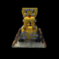

# CustomNeRF

From-Scratch implementation of the original [NeRF paper](https://github.com/bmild/nerf). Used as a basis for later experiments with the NeRF architecture.

Example training with 100 images on the (100x100) tiny_nerf_data.npz lego dataset.  


## Installation

Install the required python packages with `requirements.txt`: `pip install -r requirements.txt`.  

## Usage

- Training of a NeRF can be started with `python run_nerf.py --mode train --config <path_to_config>`
- Inference of a trained NeRF can be started with `python run_nerf.py --mode infer --config <path_to_config>`

Examples of config files and datasets can be found in `experiments/` and `data/`.  
A good testexample is the small lego dataset: `experiments\test_exp\testexperiment.txt`, `data\tiny_nerf_data.npz`.  

## Project Structure

```plaintext
.
├── data/  # Contains the data files used in the project.
├── data_handling_test.py  # Contains tests for data handling functions.
├── experiments/  # Contains experiment configuration files.
├── model/  # Contains the neural network model definitions for the project.
│   ├── feature_embedding.py  # Contains the feature embedding model.
│   ├── NeRF.py  # Contains the NeRF model.
│   └── RadianceFieldEncoder.py  # Contains the Basic Radiance Field Encoder model.
├── requirements.txt  # Lists the Python packages required for the project.
├── run_nerf.py  # The main script to train or infer a NeRF model.
│── training/  # Contains scripts related to training and inference.
│   ├── early_stopping.py  # Contains the early stopping mechanism for training.
│   ├── inference/
│   │   ├── infer.py  # Contains the main inference script.
│   |   └── render_path_generator.py # Contains logic for calculating a renderpath with novel views.
│   ├── nerf_inference.py  # Contains the inference logic for the NeRF model.
│   ├── setup_stuff.py  # Contains setup functions for training and inference.
│   ├── train.py  # Contains the main training script.
│   └── utils.py  # Contains utility functions for training.
└── volume_handling/  # Contains scripts for loading and handling volume data.
    |── data_handling.py  # Contains functions for loading and processing volume data.
    ├── rays_rgb_dataset.py # Dataset for getting batches of rays and corresponding rgb values.
    ├── rendering.py # Volume integration to convert rgbo values of NeRF samples into pixel values.
    ├── sampling.py # Contains functions for ray creation and ray sampling along the rays.
    └── utils.py # Contains utility functions for data loading.
```
